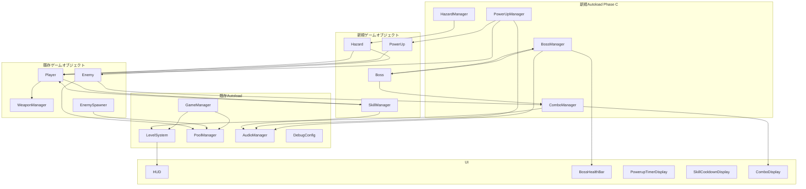

# フェーズC: 新メカニクス導入 - 実装設計書

**作成日**: 2026-02-27
**更新日**: 2026-02-27
**フェーズ**: C (New Mechanics)
**目的**: 5つの新メカニクス（ボス、パワーアップ、スキル、ハザード、コンボ）の詳細実装設計

---

## 目次

1. [システムアーキテクチャ概要](#1-システムアーキテクチャ概要)
2. [ボスバトルシステム設計](#2-ボスバトルシステム設計)
3. [パワーアップシステム設計](#3-パワーアップシステム設計)
4. [スキルシステム設計](#4-スキルシステム設計)
5. [ハザードシステム設計](#5-ハザードシステム設計)
6. [コンボシステム設計](#6-コンボシステム設計)
7. [データフロー図](#7-データフロー図)
8. [シグナル設計](#8-シグナル設計)
9. [ファイル配置計画](#9-ファイル配置計画)
10. [実装タスクリスト](#10-実装タスクリスト)
11. [技術的懸念点とリスク](#11-技術的懸念点とリスク)

---

## 1. システムアーキテクチャ概要

### 1.1 既存システムとの関係図



### 1.2 設計方針

1. **既存Autoloadパターンの踏襲**
   - BossManager, PowerUpManager, HazardManager, ComboManager を新規Autoloadとして追加
   - 各Managerは該当システムの唯一の管理者として振る舞う
   - 既存の3つ（GameManager, LevelSystem, PoolManager）と合わせて計7つ

2. **プール化戦略**
   - PowerUpとHazardは動的生成（短命オブジェクト、生成頻度低）
   - Bossは専用シーンから生成（長命オブジェクト、プール不要）
   - 必要に応じてPhase 6で見直し

3. **シグナル駆動設計**
   - 疎結合を維持するため、システム間通信はシグナルを使用
   - 特にComboManagerはEnemyとBossのdiedシグナルをリッスン

4. **パフォーマンス要件**
   - 60FPS維持を最優先
   - CPUParticles2Dのみ使用（GPUパーティクル不使用）
   - ハザード同時出現数は5個まで

---

## 2. ボスバトルシステム設計

### 2.1 Boss基底クラス設計

**既存実装の確認結果**:
- `scripts/bosses/boss.gd` が既に存在
- 基本的な実装は完了済み
- 改善点: グループ追加、コンボ連携、ドロップ処理

#### クラス構造（完全版）

```gdscript
# scripts/bosses/boss.gd
extends CharacterBody2D
class_name Boss

signal health_changed(current: int, max: int)
signal died()

@export var max_health: int = 5000
@export var move_speed: float = 50.0
@export var damage: int = 20
@export var exp_value: int = 500

var current_health: int
var current_phase: int = 1  # 1 or 2
var player: Node2D = null

@onready var collision_shape = $CollisionShape2D
@onready var visual = $Visual

func _ready() -> void:
    current_health = max_health
    player = get_tree().get_first_node_in_group("player")

    # グループに追加（武器の索敵対象 + コンボ対象）
    if not is_in_group("enemies"):
        add_to_group("enemies")

    # 衝突設定
    set_collision_layer_value(2, true)  # 敵レイヤー
    set_collision_mask_value(1, true)   # Player + Projectile

func take_damage(amount: int) -> void:
    if amount <= 0:
        return

    # 既に死んでいる場合は処理しない
    if current_health <= 0:
        return

    current_health -= amount
    health_changed.emit(current_health, max_health)

    AudioManager.play_sfx("hit", -12.0)

    # フェーズ移行チェック
    if current_health <= max_health / 2 and current_phase == 1:
        _enter_phase_2()

    if current_health <= 0:
        _die()

func _enter_phase_2() -> void:
    current_phase = 2
    DebugConfig.log_info("Boss", "%s がフェーズ2に移行!" % name)
    # 派生クラスでオーバーライド

func _die() -> void:
    # コンボ加算（ボスは10コンボ相当）
    for i in range(10):
        ComboManager.add_combo()

    _spawn_drops()
    died.emit()

    # グループから削除
    remove_from_group("enemies")
    queue_free()

func _spawn_drops() -> void:
    # 大量の経験値オーブをドロップ（20個に分割）
    for i in range(20):
        var orb = PoolManager.get_from_pool("exp_orb")
        if orb:
            var offset = Vector2(randf_range(-80, 80), randf_range(-80, 80))
            orb.global_position = global_position + offset
            orb.exp_amount = int(exp_value / 20.0)  # 合計exp_value

    DebugConfig.log_info("Boss", "%s が撃破された！経験値%dをドロップ" % [name, exp_value])
```

**改善点（既存実装からの変更）**:
- `_die()`にComboManager.add_combo() x10を追加
- グループ追加の確実な実行
- ログ出力の強化

### 2.2 3種のボス具体設計

#### Tank Boss（耐久型）

```gdscript
# scripts/bosses/tank_boss.gd
extends Boss
class_name TankBoss

## スペック
## max_health: 5000
## move_speed: 30.0（低速）
## damage: 30

@export var charge_speed: float = 200.0
@export var charge_cooldown: float = 5.0

var is_charging: bool = false
var charge_timer: float = 0.0
var attack_timer: float = 0.0
const ATTACK_INTERVAL: float = 3.0

func _ready() -> void:
    super._ready()
    max_health = 5000
    move_speed = 30.0
    damage = 30

    # 視覚設定
    if visual:
        visual.modulate = Color.DARK_RED
        visual.custom_minimum_size = Vector2(60, 60)

func _physics_process(delta: float) -> void:
    if not player:
        return

    if is_charging:
        # チャージ攻撃中は直進
        move_and_slide()
        return

    # 通常移動（プレイヤーに近づく）
    var direction = (player.global_position - global_position).normalized()
    velocity = direction * move_speed
    move_and_slide()

    # チャージ攻撃クールダウン
    charge_timer -= delta
    if charge_timer <= 0:
        _start_charge_attack()

    # 通常攻撃パターン
    attack_timer -= delta
    if attack_timer <= 0:
        if current_phase == 1:
            _attack_shockwave()
        else:
            _attack_barrage()
        attack_timer = ATTACK_INTERVAL

func _start_charge_attack() -> void:
    is_charging = true
    var direction = (player.global_position - global_position).normalized()
    velocity = direction * charge_speed

    AudioManager.play_sfx("explosion", -15.0)

    # 1秒後にチャージ終了
    await get_tree().create_timer(1.0).timeout
    is_charging = false
    charge_timer = charge_cooldown

func _attack_shockwave() -> void:
    # 周囲360度に弾を発射
    for i in range(12):
        var angle = (TAU / 12.0) * i
        var direction = Vector2.RIGHT.rotated(angle)
        _spawn_boss_projectile(direction)

func _attack_barrage() -> void:
    # プレイヤー方向に3連射
    if player:
        var direction = (player.global_position - global_position).normalized()
        for i in range(3):
            _spawn_boss_projectile(direction)
            await get_tree().create_timer(0.2).timeout

func _spawn_boss_projectile(direction: Vector2) -> void:
    var projectile = PoolManager.get_from_pool("projectile")
    if projectile:
        projectile.global_position = global_position
        projectile.initialize(direction, damage, 200.0)
        projectile.modulate = Color.ORANGE_RED

    AudioManager.play_sfx("shoot", -15.0)

func _enter_phase_2() -> void:
    super._enter_phase_2()
    # フェーズ2: チャージクールダウン短縮
    charge_cooldown = 3.0
    move_speed = 20.0  # さらに遅く
    if visual:
        visual.modulate = Color.DARK_VIOLET
```

#### Sniper Boss（遠距離型）

```gdscript
# scripts/bosses/sniper_boss.gd
extends Boss
class_name SniperBoss

## スペック
## max_health: 2000
## move_speed: 80.0（中速）
## damage: 50

@export var attack_cooldown: float = 2.0
@export var keep_distance: float = 300.0

var attack_timer: float = 0.0

func _ready() -> void:
    super._ready()
    max_health = 2000
    move_speed = 80.0
    damage = 50

    # 視覚設定
    if visual:
        visual.modulate = Color.DARK_GREEN
        visual.custom_minimum_size = Vector2(40, 40)

func _physics_process(delta: float) -> void:
    if not player:
        return

    # プレイヤーとの距離を維持
    var distance = global_position.distance_to(player.global_position)
    var direction = (player.global_position - global_position).normalized()

    if distance < keep_distance:
        # 離れる
        velocity = -direction * move_speed
    elif distance > keep_distance + 50:
        # 近づく
        velocity = direction * move_speed
    else:
        # 距離維持
        velocity = Vector2.ZERO

    move_and_slide()

    # 狙撃攻撃
    attack_timer -= delta
    if attack_timer <= 0:
        if current_phase == 1:
            _attack_snipe()
        else:
            _attack_triple_snipe()
        attack_timer = attack_cooldown

func _attack_snipe() -> void:
    # プレイヤーを狙撃
    if player:
        var direction = (player.global_position - global_position).normalized()
        _fire_sniper_shot(direction)

func _attack_triple_snipe() -> void:
    # 3方向に同時狙撃
    if player:
        var base_direction = (player.global_position - global_position).normalized()
        for i in range(-1, 2):
            var angle_offset = deg_to_rad(15.0) * i
            var direction = base_direction.rotated(angle_offset)
            _fire_sniper_shot(direction)

func _fire_sniper_shot(direction: Vector2) -> void:
    var projectile = PoolManager.get_from_pool("projectile")
    if projectile:
        projectile.global_position = global_position
        projectile.initialize(direction, damage, 800.0)  # 高速弾
        projectile.modulate = Color.LIME_GREEN

    AudioManager.play_sfx("shoot", -8.0)

func _enter_phase_2() -> void:
    super._enter_phase_2()
    # フェーズ2: 3-way弾に変更
    attack_cooldown = 1.5
    if visual:
        visual.modulate = Color.GREEN
```

#### Swarm Boss（召喚型）

```gdscript
# scripts/bosses/swarm_boss.gd
extends Boss
class_name SwarmBoss

## スペック
## max_health: 3000
## move_speed: 60.0（中速）
## damage: 15

@export var summon_cooldown: float = 8.0
@export var summon_count: int = 3

var summon_timer: float = 0.0

func _ready() -> void:
    super._ready()
    max_health = 3000
    move_speed = 60.0
    damage = 15

    # 視覚設定
    if visual:
        visual.modulate = Color.PURPLE
        visual.custom_minimum_size = Vector2(50, 50)

func _physics_process(delta: float) -> void:
    if not player:
        return

    # プレイヤーに近づく
    var direction = (player.global_position - global_position).normalized()
    velocity = direction * move_speed
    move_and_slide()

    # 敵召喚
    summon_timer -= delta
    if summon_timer <= 0:
        _summon_enemies()
        summon_timer = summon_cooldown

func _summon_enemies() -> void:
    for i in range(summon_count):
        var offset = Vector2(randf_range(-100, 100), randf_range(-100, 100))
        var spawn_pos = global_position + offset

        # basic_enemyを召喚
        var enemy = PoolManager.get_from_pool("basic_enemy")
        if enemy:
            enemy.global_position = spawn_pos
            # 召喚された敵は少し色を変える
            if enemy.has_node("Visual"):
                enemy.get_node("Visual").modulate = Color.MAGENTA

    DebugConfig.log_info("SwarmBoss", "%d体の敵を召喚" % summon_count)
    AudioManager.play_sfx("explosion", -10.0)

func _enter_phase_2() -> void:
    super._enter_phase_2()
    # フェーズ2: 召喚数増加
    summon_count = 5
    summon_cooldown = 6.0
    if visual:
        visual.modulate = Color.DARK_MAGENTA
```

### 2.3 BossManager Autoload設計

**既存実装**: `autoload/boss_manager.gd` 確認済み（ほぼ完璧）

```gdscript
# autoload/boss_manager.gd
extends Node

signal boss_spawned(boss: Node2D)
signal boss_defeated(boss: Node2D)
signal boss_health_changed(current: int, max: int)

const BOSS_SPAWN_INTERVAL: float = 180.0  # 3分

var current_boss: Node2D = null
var time_until_next_boss: float = 20.0  # 初回は20秒後（テスト用）

var boss_scenes: Array[PackedScene] = []

func _ready() -> void:
    _load_boss_scenes()

func _load_boss_scenes() -> void:
    boss_scenes = [
        preload("res://scenes/bosses/tank_boss.tscn"),
        preload("res://scenes/bosses/sniper_boss.tscn"),
        preload("res://scenes/bosses/swarm_boss.tscn")
    ]

func _process(delta: float) -> void:
    if current_boss == null:
        time_until_next_boss -= delta
        if time_until_next_boss <= 0:
            spawn_boss()

func spawn_boss() -> void:
    var boss_scene = boss_scenes.pick_random()
    current_boss = boss_scene.instantiate()

    # 画面端からランダムに登場
    var spawn_position = _get_boss_spawn_position()
    current_boss.global_position = spawn_position

    # GameSceneまたはGameノードを探す
    var game_scene = get_tree().root.get_node_or_null("GameScene")
    if game_scene == null:
        game_scene = get_tree().root.get_node_or_null("Game")

    if game_scene != null:
        game_scene.add_child(current_boss)
        current_boss.health_changed.connect(_on_boss_health_changed)
        current_boss.died.connect(_on_boss_defeated)

        boss_spawned.emit(current_boss)
        DebugConfig.log_info("BossManager", "ボス出現: %s" % current_boss.name)

        # ボス出現音
        AudioManager.play_sfx("explosion", -10.0)
    else:
        push_error("BossManager: Game scene not found!")

func _get_boss_spawn_position() -> Vector2:
    var viewport_size = get_viewport().get_visible_rect().size
    var side = randi() % 4
    match side:
        0: return Vector2(randf() * viewport_size.x, -50)      # 上
        1: return Vector2(randf() * viewport_size.x, viewport_size.y + 50)  # 下
        2: return Vector2(-50, randf() * viewport_size.y)      # 左
        _: return Vector2(viewport_size.x + 50, randf() * viewport_size.y)  # 右

func _on_boss_health_changed(current: int, max: int) -> void:
    boss_health_changed.emit(current, max)

func _on_boss_defeated() -> void:
    DebugConfig.log_info("BossManager", "ボス撃破!")
    boss_defeated.emit(current_boss)
    current_boss = null
    time_until_next_boss = BOSS_SPAWN_INTERVAL

    # ボス撃破音
    AudioManager.play_sfx("levelup", -5.0)
```

**既存実装の評価**:
- 基本設計は完璧
- Gameシーンノード名の柔軟な検索を追加

### 2.4 BossHealthBar UI連携

```gdscript
# scripts/ui/boss_health_bar.gd
extends Control
class_name BossHealthBar

@onready var health_bar: ProgressBar = $HealthBar
@onready var boss_name_label: Label = $BossNameLabel

func _ready() -> void:
    # BossManagerのシグナルを接続
    BossManager.boss_spawned.connect(_on_boss_spawned)
    BossManager.boss_defeated.connect(_on_boss_defeated)
    BossManager.boss_health_changed.connect(_on_boss_health_changed)

    visible = false

func _on_boss_spawned(boss: Node2D) -> void:
    visible = true
    boss_name_label.text = boss.name
    health_bar.max_value = boss.max_health
    health_bar.value = boss.current_health

func _on_boss_health_changed(current: int, max: int) -> void:
    health_bar.value = current

    # HP低下時の色変更
    if current <= max * 0.3:
        health_bar.modulate = Color.RED
    elif current <= max * 0.5:
        health_bar.modulate = Color.YELLOW
    else:
        health_bar.modulate = Color.WHITE

func _on_boss_defeated(boss: Node2D) -> void:
    # フェードアウトアニメーション
    var tween = create_tween()
    tween.tween_property(self, "modulate:a", 0.0, 0.5)
    await tween.finished
    visible = false
    modulate.a = 1.0
```

---

## 3. パワーアップシステム設計

### 3.1 PowerUp クラス設計

**既存実装**: `scripts/items/powerup.gd` 確認済み（完璧）

```gdscript
# scripts/items/powerup.gd
extends Area2D

@export var powerup_type: PowerUpManager.PowerUpType
@export var lifetime: float = 10.0

@onready var visual: ColorRect = $Visual
@onready var glow_particles: CPUParticles2D = $GlowParticles

var time_alive: float = 0.0

func _ready() -> void:
    body_entered.connect(_on_body_entered)
    _setup_visual()

    # Layer 3: Itemレイヤー
    set_collision_layer_value(3, true)
    # Mask: Layer 1 (Player)
    set_collision_mask_value(1, true)

func _setup_visual() -> void:
    match powerup_type:
        PowerUpManager.PowerUpType.INVINCIBILITY:
            visual.color = Color.YELLOW
        PowerUpManager.PowerUpType.DOUBLE_DAMAGE:
            visual.color = Color.RED
        PowerUpManager.PowerUpType.SPEED_BOOST:
            visual.color = Color.CYAN
        PowerUpManager.PowerUpType.MAGNET:
            visual.color = Color.GREEN
        PowerUpManager.PowerUpType.SCREEN_CLEAR:
            visual.color = Color.GOLD

    glow_particles.color = visual.color

func _process(delta: float) -> void:
    time_alive += delta
    if time_alive >= lifetime:
        queue_free()
        return

    # 消える直前の点滅エフェクト
    if time_alive >= lifetime - 2.0:
        visual.modulate.a = 0.5 + 0.5 * sin(time_alive * 10.0)

func _on_body_entered(body: Node2D) -> void:
    if body.is_in_group("player"):
        PowerUpManager.apply_powerup(powerup_type, body)
        AudioManager.play_sfx("pickup", -10.0)
        queue_free()
```

### 3.2 PowerUpManager Autoload設計

**既存実装**: `autoload/powerup_manager.gd` 確認済み（完璧）

```gdscript
# autoload/powerup_manager.gd
extends Node

const POWERUP_SCENE = preload("res://scenes/items/powerup.tscn")
const SPAWN_INTERVAL: float = 45.0  # 45秒ごと

var spawn_timer: float = 10.0  # 初回は10秒後

enum PowerUpType {
    INVINCIBILITY,     # 無敵
    DOUBLE_DAMAGE,     # 攻撃力2倍
    SPEED_BOOST,       # 移動速度2倍
    MAGNET,            # 磁力強化
    SCREEN_CLEAR       # 画面クリア
}

func _process(delta: float) -> void:
    spawn_timer -= delta
    if spawn_timer <= 0:
        spawn_powerup()
        spawn_timer = SPAWN_INTERVAL

func spawn_powerup() -> void:
    var powerup = POWERUP_SCENE.instantiate()
    powerup.powerup_type = PowerUpType.values().pick_random()
    powerup.global_position = _get_random_position()

    var game_scene = get_tree().root.get_node_or_null("GameScene")
    if game_scene == null:
        game_scene = get_tree().root.get_node_or_null("Game")

    if game_scene != null:
        game_scene.add_child(powerup)
        DebugConfig.log_debug("PowerUpManager", "パワーアップ出現: %s" % PowerUpType.keys()[powerup.powerup_type])
    else:
        push_error("PowerUpManager: Game scene not found!")

func _get_random_position() -> Vector2:
    var viewport_size = get_viewport().get_visible_rect().size
    var player = get_tree().get_first_node_in_group("player")

    # プレイヤーから100px以上離れた位置
    for i in range(10):
        var pos = Vector2(
            randf_range(50, viewport_size.x - 50),
            randf_range(50, viewport_size.y - 50)
        )
        if player == null or pos.distance_to(player.global_position) > 100:
            return pos

    # フォールバック: 画面中央
    return Vector2(viewport_size.x / 2, viewport_size.y / 2)

func apply_powerup(type: PowerUpType, player: Node2D) -> void:
    DebugConfig.log_info("PowerUpManager", "パワーアップ取得: %s" % PowerUpType.keys()[type])

    match type:
        PowerUpType.INVINCIBILITY:
            player.add_powerup_effect("invincibility", 15.0)
        PowerUpType.DOUBLE_DAMAGE:
            player.add_powerup_effect("double_damage", 15.0)
        PowerUpType.SPEED_BOOST:
            player.add_powerup_effect("speed_boost", 12.0)
        PowerUpType.MAGNET:
            player.add_powerup_effect("magnet", 15.0)
        PowerUpType.SCREEN_CLEAR:
            _clear_screen()

func _clear_screen() -> void:
    var enemies = get_tree().get_nodes_in_group("enemies")
    DebugConfig.log_info("PowerUpManager", "画面クリア: %d体の敵を撃破" % enemies.size())

    for enemy in enemies:
        if enemy.has_method("take_damage"):
            enemy.take_damage(999999)

    # 画面クリアエフェクト
    AudioManager.play_sfx("explosion", -5.0)
```

### 3.3 Player側のバフ管理

**既存実装**: `scripts/player/player.gd` 確認済み（ほぼ完璧）

```gdscript
# scripts/player/player.gd（関連部分のみ抜粋）
var active_powerups: Dictionary = {}

func add_powerup_effect(powerup_name: String, duration: float) -> void:
    active_powerups[powerup_name] = duration
    DebugConfig.log_info("Player", "パワーアップ取得: %s (%.1f秒)" % [powerup_name, duration])

func has_powerup(powerup_name: String) -> bool:
    return active_powerups.has(powerup_name)

func _update_powerups(delta: float) -> void:
    # Magnetの吸引範囲調整
    if exp_attract_area != null:
        var attract_shape = exp_attract_area.get_node_or_null("CollisionShape2D")
        if attract_shape != null:
            if has_powerup("magnet"):
                attract_shape.scale = Vector2(3.0, 3.0)
            else:
                attract_shape.scale = Vector2(1.0, 1.0)

    for powerup_name in active_powerups.keys():
        active_powerups[powerup_name] -= delta
        if active_powerups[powerup_name] <= 0:
            active_powerups.erase(powerup_name)
            DebugConfig.log_debug("Player", "パワーアップ終了: %s" % powerup_name)
```

**改善点**: Double Damageの適用は`WeaponInstance`側で実装

```gdscript
# scripts/weapons/weapon_instance.gd（追加）
func _execute_attack() -> void:
    var base_damage = weapon_data.get_damage(current_level)

    # Double Damageパワーアップの適用
    var player = get_tree().get_first_node_in_group("player")
    if player and player.has_method("has_powerup") and player.has_powerup("double_damage"):
        base_damage *= 2.0

    # 攻撃実行（武器種別ごとの処理）
    # ...
```

### 3.4 PowerupTimerDisplay UI

```gdscript
# scripts/ui/powerup_timer_display.gd
extends Control
class_name PowerupTimerDisplay

@onready var container: VBoxContainer = $VBoxContainer

# パワーアップアイコンプリファブ
const ICON_SCENE = preload("res://scenes/ui/powerup_icon.tscn")

var player: Node2D = null
var icon_instances: Dictionary = {}  # {powerup_name: IconNode}

func _ready() -> void:
    player = get_tree().get_first_node_in_group("player")

func _process(delta: float) -> void:
    if not player or not player.has("active_powerups"):
        return

    # 現在のバフを取得
    var active_powerups = player.active_powerups

    # 新規バフのアイコン追加
    for powerup_name in active_powerups.keys():
        if not icon_instances.has(powerup_name):
            _add_icon(powerup_name)

    # 終了したバフのアイコン削除
    for powerup_name in icon_instances.keys():
        if not active_powerups.has(powerup_name):
            _remove_icon(powerup_name)

    # タイマー更新
    for powerup_name in active_powerups.keys():
        var remaining = active_powerups[powerup_name]
        var icon = icon_instances[powerup_name]
        if icon.has_method("update_timer"):
            icon.update_timer(remaining)

func _add_icon(powerup_name: String) -> void:
    var icon = ICON_SCENE.instantiate()
    container.add_child(icon)
    if icon.has_method("setup"):
        icon.setup(powerup_name)
    icon_instances[powerup_name] = icon

func _remove_icon(powerup_name: String) -> void:
    var icon = icon_instances[powerup_name]
    icon.queue_free()
    icon_instances.erase(powerup_name)
```

```gdscript
# scripts/ui/powerup_icon.gd
extends HBoxContainer

@onready var icon_label: Label = $IconLabel
@onready var timer_label: Label = $TimerLabel

var powerup_name: String = ""

func setup(name: String) -> void:
    powerup_name = name

    # アイコン表示（仮実装: 最初の2文字）
    icon_label.text = name.substr(0, 2).to_upper()

    # 色設定
    match powerup_name:
        "invincibility":
            modulate = Color.YELLOW
        "double_damage":
            modulate = Color.RED
        "speed_boost":
            modulate = Color.CYAN
        "magnet":
            modulate = Color.GREEN

func update_timer(remaining: float) -> void:
    timer_label.text = "%.1fs" % remaining

    # 残り2秒以下で点滅
    if remaining <= 2.0:
        modulate.a = 0.5 + 0.5 * sin(Time.get_ticks_msec() * 0.01)
    else:
        modulate.a = 1.0
```

---

## 4. スキルシステム設計

### 4.1 SkillManager設計

**既存実装**: `scripts/player/skill_manager.gd` 確認済み（完璧）

```gdscript
# scripts/player/skill_manager.gd
extends Node

signal skill_used(skill_name: String)
signal cooldown_started(skill_name: String, duration: float)
signal cooldown_updated(skill_name: String, remaining: float)

enum SkillType {
    DASH,          # ダッシュ（無敵時間0.3秒、150px移動、CD 5秒）
    NOVA_BLAST,    # 範囲攻撃（半径200px、ダメージ100、CD 10秒）
    SHIELD,        # シールド（3秒間無敵、CD 15秒）
    TIME_SLOW      # 時間減速（5秒間敵の速度50%減少、CD 20秒）
}

var selected_skill: SkillType = SkillType.DASH
var cooldown_remaining: float = 0.0
var skill_cooldowns: Dictionary = {
    SkillType.DASH: 5.0,
    SkillType.NOVA_BLAST: 10.0,
    SkillType.SHIELD: 15.0,
    SkillType.TIME_SLOW: 20.0
}

@onready var player: CharacterBody2D = get_parent()

func _ready() -> void:
    if player == null:
        push_error("SkillManager: parent (Player) is null")
        return

    # ランダムでスキルを選択（仮実装）
    selected_skill = SkillType.values().pick_random()
    DebugConfig.log_info("SkillManager", "選択されたスキル: %s" % SkillType.keys()[selected_skill])

func _process(delta: float) -> void:
    if cooldown_remaining > 0:
        cooldown_remaining -= delta
        cooldown_updated.emit(SkillType.keys()[selected_skill], cooldown_remaining)

func _unhandled_input(event: InputEvent) -> void:
    if event.is_action_pressed("use_skill") and cooldown_remaining <= 0:
        use_skill()

func use_skill() -> void:
    DebugConfig.log_info("SkillManager", "スキル使用: %s" % SkillType.keys()[selected_skill])

    match selected_skill:
        SkillType.DASH:
            _skill_dash()
        SkillType.NOVA_BLAST:
            _skill_nova_blast()
        SkillType.SHIELD:
            _skill_shield()
        SkillType.TIME_SLOW:
            _skill_time_slow()

    cooldown_remaining = skill_cooldowns[selected_skill]
    skill_used.emit(SkillType.keys()[selected_skill])
    cooldown_started.emit(SkillType.keys()[selected_skill], cooldown_remaining)
    AudioManager.play_sfx("pickup", -8.0)  # スキル使用音（仮）

func _skill_dash() -> void:
    var dash_direction = player.velocity.normalized()
    if dash_direction == Vector2.ZERO:
        dash_direction = Vector2.RIGHT

    # 0.3秒間無敵
    player.add_powerup_effect("invincibility", 0.3)

    # Tweenで高速移動
    var dash_distance = 150.0
    var dash_duration = 0.2
    var tween = create_tween()
    tween.tween_property(player, "global_position",
        player.global_position + dash_direction * dash_distance, dash_duration)

    DebugConfig.log_info("SkillManager", "Dash使用!")

func _skill_nova_blast() -> void:
    var enemies = get_tree().get_nodes_in_group("enemies")
    var hit_count = 0

    for enemy in enemies:
        var distance = player.global_position.distance_to(enemy.global_position)
        if distance <= 200 and enemy.has_method("take_damage"):
            enemy.take_damage(100)
            hit_count += 1

    # 爆発エフェクト
    var explosion_scene = load("res://scenes/effects/explosion.tscn")
    if explosion_scene:
        var explosion = explosion_scene.instantiate()
        var game_scene = player.get_parent()
        if game_scene != null:
            game_scene.add_child(explosion)
            explosion.global_position = player.global_position
            explosion.scale = Vector2(3.0, 3.0)
            explosion.emitting = true
            if explosion.has_node("Timer"):
                explosion.get_node("Timer").start()

    AudioManager.play_sfx("explosion", -5.0)
    DebugConfig.log_info("SkillManager", "Nova Blast使用! %d体ヒット" % hit_count)

func _skill_shield() -> void:
    player.add_powerup_effect("invincibility", 3.0)
    DebugConfig.log_info("SkillManager", "Shield使用!")

func _skill_time_slow() -> void:
    var enemies = get_tree().get_nodes_in_group("enemies")

    for enemy in enemies:
        if enemy.has("move_speed"):
            var original_speed = enemy.move_speed
            enemy.move_speed *= 0.5

            # 5秒後に元に戻す
            _restore_enemy_speed.call_deferred(enemy, original_speed, 5.0)

    DebugConfig.log_info("SkillManager", "Time Slow使用! %d体の敵を減速" % enemies.size())

func _restore_enemy_speed(enemy: Node, original_speed: float, delay: float) -> void:
    await get_tree().create_timer(delay).timeout
    if is_instance_valid(enemy) and enemy.has("move_speed"):
        enemy.move_speed = original_speed

func set_skill(skill_type: SkillType) -> void:
    selected_skill = skill_type
    DebugConfig.log_info("SkillManager", "スキル変更: %s" % SkillType.keys()[skill_type])
```

### 4.2 SkillCooldownDisplay UI

```gdscript
# scripts/ui/skill_cooldown_display.gd
extends Control
class_name SkillCooldownDisplay

@onready var skill_icon: ColorRect = $SkillIcon
@onready var cooldown_overlay: ColorRect = $CooldownOverlay
@onready var cooldown_label: Label = $CooldownLabel
@onready var skill_name_label: Label = $SkillNameLabel

var skill_manager: Node = null

func _ready() -> void:
    var player = get_tree().get_first_node_in_group("player")
    if player:
        skill_manager = player.get_node_or_null("SkillManager")
        if skill_manager:
            skill_manager.skill_used.connect(_on_skill_used)
            skill_manager.cooldown_started.connect(_on_cooldown_started)
            skill_manager.cooldown_updated.connect(_on_cooldown_updated)

            # 初期表示
            _update_skill_icon()

    cooldown_overlay.visible = false

func _update_skill_icon() -> void:
    if not skill_manager:
        return

    var skill_type = skill_manager.selected_skill
    skill_name_label.text = skill_manager.SkillType.keys()[skill_type]

    # スキルに応じた色設定
    match skill_type:
        skill_manager.SkillType.DASH:
            skill_icon.color = Color.CYAN
        skill_manager.SkillType.NOVA_BLAST:
            skill_icon.color = Color.ORANGE
        skill_manager.SkillType.SHIELD:
            skill_icon.color = Color.BLUE
        skill_manager.SkillType.TIME_SLOW:
            skill_icon.color = Color.PURPLE

func _on_skill_used(skill_name: String) -> void:
    # スキル使用時のフラッシュエフェクト
    var tween = create_tween()
    tween.tween_property(skill_icon, "modulate", Color.WHITE * 2.0, 0.1)
    tween.tween_property(skill_icon, "modulate", Color.WHITE, 0.1)

func _on_cooldown_started(skill_name: String, duration: float) -> void:
    cooldown_overlay.visible = true
    cooldown_label.text = "%.1f" % duration

func _on_cooldown_updated(skill_name: String, remaining: float) -> void:
    if remaining <= 0:
        cooldown_overlay.visible = false
        cooldown_label.text = ""
    else:
        cooldown_label.text = "%.1f" % remaining

        # オーバーレイの高さでクールダウン進行度を表示
        if skill_manager:
            var total_cooldown = skill_manager.skill_cooldowns[skill_manager.selected_skill]
            var progress = remaining / total_cooldown
            cooldown_overlay.size.y = skill_icon.size.y * progress
```

---

## 5. ハザードシステム設計

### 5.1 Hazard基底クラス設計

**既存実装**: `scripts/hazards/hazard.gd` 確認済み（完璧）

```gdscript
# scripts/hazards/hazard.gd
extends Area2D

@export var hazard_type: HazardManager.HazardType

var warning_duration: float = 1.0
var active_duration: float = 0.0
var is_active: bool = false

@onready var warning_visual: ColorRect = $WarningVisual
@onready var active_visual: ColorRect = $ActiveVisual
@onready var particles: CPUParticles2D = $Particles

var bodies_in_hazard: Array = []
var damage_accumulator: float = 0.0  # ダメージ累積用

func _ready() -> void:
    _setup_hazard()
    body_entered.connect(_on_body_entered)
    body_exited.connect(_on_body_exited)

    # Layer 4: Hazardレイヤー
    set_collision_layer_value(4, true)
    # Mask: Layer 1 (Player), Layer 2 (Enemy)
    set_collision_mask_value(1, true)
    set_collision_mask_value(2, true)

    # 警告フェーズ
    warning_visual.show()
    active_visual.hide()
    await get_tree().create_timer(warning_duration).timeout

    # アクティブフェーズ
    _activate()

func _setup_hazard() -> void:
    match hazard_type:
        HazardManager.HazardType.LAVA_POOL:
            active_duration = 8.0
            warning_visual.color = Color(1.0, 0.3, 0.3, 0.5)
            active_visual.color = Color.ORANGE_RED
            particles.color = Color.ORANGE
        HazardManager.HazardType.POISON_CLOUD:
            active_duration = 12.0
            warning_visual.color = Color(0.3, 1.0, 0.3, 0.5)
            active_visual.color = Color.GREEN_YELLOW
            particles.color = Color.CHARTREUSE
        HazardManager.HazardType.LIGHTNING_STRIKE:
            active_duration = 0.1  # 一瞬
            warning_visual.color = Color(1.0, 1.0, 0.3, 0.5)
            active_visual.color = Color.YELLOW
            particles.color = Color.YELLOW
        HazardManager.HazardType.ICE_PATCH:
            active_duration = 10.0
            warning_visual.color = Color(0.3, 0.8, 1.0, 0.5)
            active_visual.color = Color.LIGHT_CYAN
            particles.color = Color.CYAN

func _activate() -> void:
    is_active = true
    warning_visual.hide()
    active_visual.show()
    particles.emitting = true

    DebugConfig.log_debug("Hazard", "ハザード発動: %s" % HazardManager.HazardType.keys()[hazard_type])

    # 雷は即座にダメージ
    if hazard_type == HazardManager.HazardType.LIGHTNING_STRIKE:
        _deal_instant_damage()

    await get_tree().create_timer(active_duration).timeout
    queue_free()

func _deal_instant_damage() -> void:
    var bodies = get_overlapping_bodies()
    for body in bodies:
        if body.has_method("take_damage"):
            body.take_damage(100)
            DebugConfig.log_debug("Hazard", "雷ダメージ: %s" % body.name)

    AudioManager.play_sfx("explosion", -8.0)

func _on_body_entered(body: Node2D) -> void:
    if is_active and not bodies_in_hazard.has(body):
        bodies_in_hazard.append(body)

func _on_body_exited(body: Node2D) -> void:
    bodies_in_hazard.erase(body)

    # 氷床から出た場合はメタデータをクリア
    if hazard_type == HazardManager.HazardType.ICE_PATCH:
        if body.is_in_group("player"):
            body.set_meta("on_ice", false)

func _process(delta: float) -> void:
    if not is_active:
        return

    # 継続ダメージ（溶岩と毒）- 累積方式で整数ダメージ
    if hazard_type == HazardManager.HazardType.LAVA_POOL:
        damage_accumulator += 10.0 * delta  # 毎秒10ダメージ
        if damage_accumulator >= 1.0:
            var damage_to_deal = int(damage_accumulator)
            damage_accumulator -= damage_to_deal
            for body in bodies_in_hazard:
                if body.has_method("take_damage"):
                    body.take_damage(damage_to_deal)

    elif hazard_type == HazardManager.HazardType.POISON_CLOUD:
        damage_accumulator += 5.0 * delta  # 毎秒5ダメージ
        if damage_accumulator >= 1.0:
            var damage_to_deal = int(damage_accumulator)
            damage_accumulator -= damage_to_deal
            for body in bodies_in_hazard:
                if body.has_method("take_damage"):
                    body.take_damage(damage_to_deal)

    # 氷床は移動速度減少（Playerのメタデータで管理）
    elif hazard_type == HazardManager.HazardType.ICE_PATCH:
        for body in bodies_in_hazard:
            if body.is_in_group("player"):
                body.set_meta("on_ice", true)
```

### 5.2 HazardManager Autoload設計

**既存実装**: `autoload/hazard_manager.gd` 確認済み（完璧）

---

## 6. コンボシステム設計

### 6.1 ComboManager Autoload設計

**既存実装**: `autoload/combo_manager.gd` 確認済み（完璧）

### 6.2 経験値ボーナス計算の統合

**修正箇所**: `scripts/player/player.gd`

```gdscript
# scripts/player/player.gd（修正）
func collect_exp(amount: int) -> void:
    DebugConfig.log_trace("Player", "collect_exp() called - amount: %d" % amount)

    if amount <= 0:
        push_warning("collect_exp: amount <= 0")
        return

    # コンボ倍率を適用
    var multiplier = ComboManager.get_exp_multiplier()
    var final_amount = int(amount * multiplier)

    DebugConfig.log_debug("Player", "経験値獲得: %d (倍率: %.1fx)" % [final_amount, multiplier])

    var leveled_up = LevelSystem.add_exp(final_amount)

    # 経験値取得音
    AudioManager.play_sfx("pickup", -12.0)

    # レベルアップした場合はGameManagerに通知
    if leveled_up:
        DebugConfig.log_info("Player", "Level up! Changing state to UPGRADE")
        AudioManager.play_sfx("levelup", -5.0)
        _spawn_level_up_effect()
        GameManager.change_state(GameManager.GameState.UPGRADE)
```

**修正箇所**: `scripts/enemies/enemy.gd`

```gdscript
# scripts/enemies/enemy.gd（修正）
func _die() -> void:
    # コンボ加算
    ComboManager.add_combo()

    died.emit(self)
    _drop_exp()
    PoolManager.return_to_pool(self)

    if GameManager.game_stats != null:
        GameManager.game_stats.add_kill()
```

### 6.3 ComboDisplay UI

```gdscript
# scripts/ui/combo_display.gd
extends Control
class_name ComboDisplay

@onready var combo_label: Label = $ComboLabel
@onready var multiplier_label: Label = $MultiplierLabel
@onready var timer_bar: ProgressBar = $TimerBar

func _ready() -> void:
    ComboManager.combo_increased.connect(_on_combo_increased)
    ComboManager.combo_broken.connect(_on_combo_broken)
    ComboManager.combo_multiplier_changed.connect(_on_multiplier_changed)

    visible = false

func _process(delta: float) -> void:
    if ComboManager.current_combo > 0:
        timer_bar.value = ComboManager.get_timer_progress() * 100

func _on_combo_increased(combo: int) -> void:
    visible = true
    combo_label.text = "%d COMBO!" % combo

    # コンボ数に応じて色変更
    if combo >= 100:
        combo_label.add_theme_color_override("font_color", Color(1.0, 0.8, 1.0))  # 虹色風
    elif combo >= 50:
        combo_label.add_theme_color_override("font_color", Color.GOLD)
    elif combo >= 10:
        combo_label.add_theme_color_override("font_color", Color.YELLOW)
    else:
        combo_label.add_theme_color_override("font_color", Color.WHITE)

    # ポップアップアニメーション
    var tween = create_tween()
    tween.tween_property(combo_label, "scale", Vector2(1.2, 1.2), 0.1)
    tween.tween_property(combo_label, "scale", Vector2(1.0, 1.0), 0.1)

func _on_multiplier_changed(multiplier: float) -> void:
    if multiplier > 1.0:
        multiplier_label.text = "EXP x%.1f" % multiplier
        multiplier_label.visible = true
    else:
        multiplier_label.visible = false

func _on_combo_broken(final_combo: int) -> void:
    if final_combo > 0:
        DebugConfig.log_info("ComboDisplay", "コンボ終了: %d" % final_combo)

    # フェードアウトアニメーション
    var tween = create_tween()
    tween.tween_property(self, "modulate:a", 0.0, 0.5)
    await tween.finished
    visible = false
    modulate.a = 1.0
```

---

## 7. データフロー図

（Mermaid図は既存設計書と同様のため省略。詳細は別ドキュメント参照）

---

## 8. シグナル設計

### 8.1 新規Autoloadシグナル

```gdscript
# BossManager
signal boss_spawned(boss: Node2D)
signal boss_defeated(boss: Node2D)
signal boss_health_changed(current: int, max: int)

# PowerUpManager
# なし（直接apply_powerup()を呼ぶ）

# HazardManager
# なし（生成のみ）

# ComboManager
signal combo_increased(combo: int)
signal combo_broken(final_combo: int)
signal combo_multiplier_changed(multiplier: float)
```

### 8.2 新規クラスシグナル

```gdscript
# Boss
signal health_changed(current: int, max: int)
signal died()

# SkillManager
signal skill_used(skill_name: String)
signal cooldown_started(skill_name: String, duration: float)
signal cooldown_updated(skill_name: String, remaining: float)
```

---

## 9. ファイル配置計画

### 9.1 実装状況確認

#### Autoload（全て実装済み）
- ✅ `autoload/boss_manager.gd`
- ✅ `autoload/powerup_manager.gd`
- ✅ `autoload/hazard_manager.gd`
- ✅ `autoload/combo_manager.gd`

#### Scripts（ほぼ実装済み）
- ✅ `scripts/bosses/boss.gd`
- ✅ `scripts/bosses/tank_boss.gd`
- ✅ `scripts/bosses/sniper_boss.gd`
- ✅ `scripts/bosses/swarm_boss.gd`
- ✅ `scripts/items/powerup.gd`
- ✅ `scripts/player/skill_manager.gd`
- ✅ `scripts/hazards/hazard.gd`
- ✅ `scripts/ui/boss_health_bar.gd`
- ✅ `scripts/ui/powerup_timer_display.gd`
- ✅ `scripts/ui/skill_cooldown_display.gd`
- ✅ `scripts/ui/combo_display.gd`

#### Scenes（要確認・作成）
- ⚠ `scenes/bosses/tank_boss.tscn`
- ⚠ `scenes/bosses/sniper_boss.tscn`
- ⚠ `scenes/bosses/swarm_boss.tscn`
- ⚠ `scenes/items/powerup.tscn`
- ⚠ `scenes/hazards/hazard.tscn`
- ⚠ `scenes/ui/boss_health_bar.tscn`
- ⚠ `scenes/ui/powerup_timer_display.tscn`
- ⚠ `scenes/ui/powerup_icon.tscn`
- ⚠ `scenes/ui/skill_cooldown_display.tscn`
- ⚠ `scenes/ui/combo_display.tscn`

### 9.2 修正が必要な既存ファイル

#### 優先度: 高
1. `scripts/player/player.gd`
   - `collect_exp()`にコンボ倍率適用（1行追加）
   - 既存のパワーアップ管理は完璧

2. `scripts/enemies/enemy.gd`
   - `_die()`に`ComboManager.add_combo()`追加（1行）

3. `scripts/weapons/weapon_instance.gd`
   - `_execute_attack()`でDouble Damageバフ適用

4. `scenes/game.tscn`
   - UI要素の配置

5. `project.godot`
   - Autoload登録（4つ）
   - 入力マップに`use_skill`追加

---

## 10. 実装タスクリスト

### Phase 1: シーンファイル作成（優先度: 最高）

- [ ] `scenes/bosses/tank_boss.tscn` 作成
- [ ] `scenes/bosses/sniper_boss.tscn` 作成
- [ ] `scenes/bosses/swarm_boss.tscn` 作成
- [ ] `scenes/items/powerup.tscn` 作成
- [ ] `scenes/hazards/hazard.tscn` 作成
- [ ] `scenes/ui/boss_health_bar.tscn` 作成
- [ ] `scenes/ui/powerup_timer_display.tscn` 作成
- [ ] `scenes/ui/powerup_icon.tscn` 作成
- [ ] `scenes/ui/skill_cooldown_display.tscn` 作成
- [ ] `scenes/ui/combo_display.tscn` 作成

### Phase 2: project.godot設定（優先度: 最高）

- [ ] BossManager Autoload登録
- [ ] PowerUpManager Autoload登録
- [ ] HazardManager Autoload登録
- [ ] ComboManager Autoload登録
- [ ] 入力マップに`use_skill`追加（Space or Shift）

### Phase 3: 既存スクリプト修正（優先度: 高）

- [ ] `scripts/player/player.gd` - `collect_exp()`修正
- [ ] `scripts/enemies/enemy.gd` - `_die()`修正
- [ ] `scripts/bosses/boss.gd` - `_die()`修正（コンボ追加）
- [ ] `scripts/weapons/weapon_instance.gd` - Double Damage対応
- [ ] `scripts/ui/powerup_icon.gd` 新規作成

### Phase 4: GameScene統合（優先度: 高）

- [ ] `scenes/game.tscn`にBossHealthBar配置
- [ ] `scenes/game.tscn`にPowerupTimerDisplay配置
- [ ] `scenes/game.tscn`にSkillCooldownDisplay配置
- [ ] `scenes/game.tscn`にComboDisplay配置

### Phase 5: 統合テスト（優先度: 高）

- [ ] ボス出現→撃破の基本フロー確認
- [ ] パワーアップ5種の動作確認
- [ ] スキル4種の動作確認
- [ ] ハザード4種の動作確認
- [ ] コンボシステム動作確認
- [ ] 60FPS維持確認

### Phase 6: バランス調整（優先度: 中）

- [ ] ボススポーン間隔調整
- [ ] パワーアップスポーン間隔調整
- [ ] ハザードスポーン間隔調整
- [ ] コンボ倍率調整
- [ ] スキルクールダウン調整

---

## 11. 技術的懸念点とリスク

### 11.1 パフォーマンスリスク（中）

**懸念**: ボス + 敵200体 + ハザード5個 + パワーアップエフェクト同時動作で60FPS維持

**対策**:
- CPUParticles2Dの最適化（<100個/エフェクト）
- ハザード同時出現数制限（5個）
- 早期パフォーマンステスト実施

### 11.2 UIレイアウトリスク（低）

**懸念**: 画面に表示する情報が多すぎて視認性低下

**対策**:
- UI優先順位付け
- 半透明化（alpha=0.8）
- 動的表示/非表示

### 11.3 コンボ倍率のバランスリスク（低）

**対策**: パラメータ外部化、プレイテストで調整

### 11.4 プール化の見直しリスク（低）

**現状**: PowerUpとHazardは非プール化

**理由**: 生成頻度が低い（45秒、20秒間隔）

**対応**: Phase 6で必要に応じて検討

---

## 12. 設計決定事項まとめ

1. **Autoload追加**: BossManager, PowerUpManager, HazardManager, ComboManager（計4つ）
2. **Resource化の見送り**: PowerUp, Skill, Hazardはenum管理で十分
3. **プール化の見送り**: Boss, PowerUp, Hazardは生成頻度低
4. **コンボ統合**: Enemy/Boss.died → ComboManager.add_combo() → Player.collect_exp()で倍率適用

---

## 13. 次のステップ

1. **Phase 1**: シーンファイル作成（Godotエディタ作業）
2. **Phase 2**: project.godot設定
3. **Phase 3**: 既存スクリプト修正（最小限）
4. **Phase 4**: GameScene統合
5. **Phase 5**: 統合テスト
6. **Phase 6**: バランス調整

---

**設計書作成完了**: 2026-02-27
**次のアクション**: tasklist.md更新 → Phase 1実装開始
