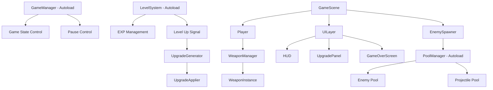
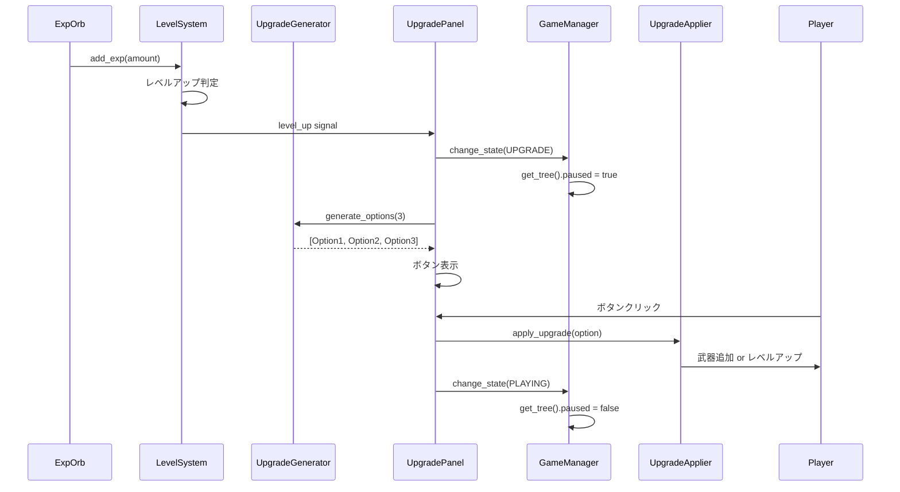
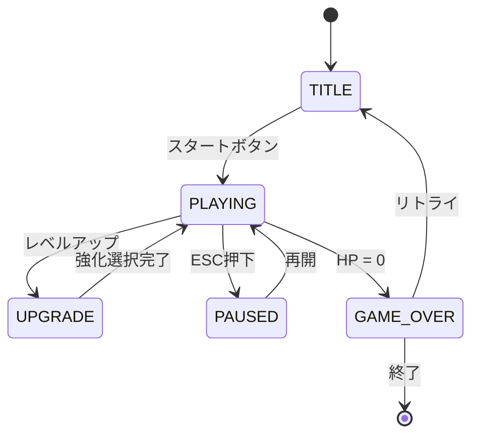

# functional-design.md
機能設計書

---

# 1. システム全体構成

## アーキテクチャ概要



## シーン構造

```
Main.tscn (エントリーポイント)
├── TitleScene.tscn (タイトル画面)
└── GameScene.tscn (メインゲーム)
    ├── Player.tscn
    │   ├── Sprite2D
    │   ├── CollisionShape2D
    │   ├── PickupArea (Area2D) - 経験値回収範囲
    │   └── WeaponManager (Node)
    │       └── WeaponInstance(s) - 動的生成
    ├── EnemySpawner (Node)
    └── UILayer (CanvasLayer)
        ├── HUD.tscn
        ├── UpgradePanel.tscn
        └── GameOverScreen.tscn

Autoload (シーンに配置しない):
- GameManager (autoload/game_manager.gd)
- LevelSystem (autoload/level_system.gd)
- PoolManager (autoload/pool_manager.gd)
```

---

# 2. Autoloadシステム設計

## 2.1 GameManager (完全Autoload)

### 責務
- ゲーム状態の一元管理
- ポーズ制御の唯一の実行者
- シーン遷移制御
- ゲーム統計の管理

### データ構造
```gdscript
# autoload/game_manager.gd
extends Node

enum GameState {
    TITLE,
    PLAYING,
    PAUSED,
    UPGRADE,
    GAME_OVER
}

var current_state: GameState = GameState.TITLE
var game_stats: GameStats # Resource

signal state_changed(new_state: GameState)
signal game_started
signal game_over

func change_state(new_state: GameState) -> void:
    current_state = new_state
    state_changed.emit(new_state)

    # ポーズ制御はここでのみ実行
    match new_state:
        GameState.UPGRADE, GameState.PAUSED, GameState.GAME_OVER:
            get_tree().paused = true
        GameState.PLAYING:
            get_tree().paused = false

func start_game() -> void:
    game_stats = GameStats.new()
    game_stats.start_time = Time.get_ticks_msec()
    change_state(GameState.PLAYING)
    game_started.emit()

func end_game() -> void:
    game_stats.end_time = Time.get_ticks_msec()
    game_stats.survival_time = (game_stats.end_time - game_stats.start_time) / 1000.0
    change_state(GameState.GAME_OVER)
    game_over.emit()
```

### ポーズ制御方式
- `get_tree().paused = true/false` を使用
- **GameManagerのみが変更権限を持つ**
- process_modeの設定:
  - UI要素: `PROCESS_MODE_ALWAYS`
  - ゲームオブジェクト: `PROCESS_MODE_PAUSABLE` (デフォルト)

---

## 2.2 LevelSystem (完全Autoload)

### 責務
- 経験値の唯一の管理者
- レベル計算
- レベルアップ通知

### データ構造
```gdscript
# autoload/level_system.gd
extends Node

# 調整可能なパラメータ
@export var base_exp: int = 10
@export var exp_growth_rate: float = 1.18  # 1.15〜1.2を推奨

var current_level: int = 1
var current_exp: int = 0
var exp_to_next_level: int = 10

signal level_up(new_level: int)
signal exp_gained(amount: int, current: int, required: int)

func add_exp(amount: int) -> void:
    """経験値オーブから直接呼ばれる"""
    current_exp += amount
    exp_gained.emit(amount, current_exp, exp_to_next_level)

    while current_exp >= exp_to_next_level:
        current_exp -= exp_to_next_level
        _level_up()

func _level_up() -> void:
    current_level += 1
    exp_to_next_level = _calculate_next_level_exp(current_level)
    level_up.emit(current_level)

func _calculate_next_level_exp(level: int) -> int:
    """経験値計算式: base_exp * (growth_rate ^ (level - 1))"""
    return int(base_exp * pow(exp_growth_rate, level - 1))

func reset() -> void:
    """ゲーム開始時に呼ぶ"""
    current_level = 1
    current_exp = 0
    exp_to_next_level = base_exp
```

### 経験値成長テーブル (growth_rate = 1.18)

| Level | 必要EXP | 累計EXP |
|-------|---------|---------|
| 1→2   | 10      | 10      |
| 2→3   | 12      | 22      |
| 5→6   | 18      | 74      |
| 10→11 | 44      | 313     |
| 20→21 | 217     | 2891    |
| 30→31 | 1072    | 16234   |

---

## 2.3 PoolManager (完全Autoload)

### 責務
- オブジェクトプールの一元管理（**シーンパス別**）
- 敵・弾丸・経験値オーブの再利用
- メモリ効率化
- 実体の親管理（Autoloadの子ではなくGameSceneへreparent）

### 設計上の重要な決定
1. **シーンパス別プール**: 敵種類ごとにプールを分ける（basic/strongの混在回避）
2. **親ノード委譲**: 生成後に`world_node`へreparent（Autoload階層問題回避）
3. **経験値オーブもプール化**: queue_free削減

### データ構造
```gdscript
# autoload/pool_manager.gd
extends Node

# プール設定
@export var initial_pool_size_per_type: int = 25
@export var max_pool_size_per_type: int = 100
@export var initial_projectile_pool_size: int = 100
@export var max_projectile_pool_size: int = 500
@export var max_exp_orb_pool_size: int = 200

# シーンパス別プール（重要: 型ごとに分離）
var enemy_pools: Dictionary = {}  # {scene_path: Array[Node]}
var active_enemies: Dictionary = {}  # {scene_path: Array[Node]}

var projectile_pool: Array[Node] = []
var active_projectiles: Array[Node] = []

var exp_orb_pool: Array[Node] = []
var active_exp_orbs: Array[Node] = []

# 実体を配置する親ノード（GameSceneから設定される）
var world_node: Node = null

func set_world_node(node: Node) -> void:
    """GameSceneから呼ばれる。実体の親として使用"""
    world_node = node

func _ready() -> void:
    # 初期プール作成は遅延（シーンパスが判明してから）
    pass

func _ensure_enemy_pool(scene_path: String) -> void:
    """敵プールが存在しない場合に初期化"""
    if scene_path in enemy_pools:
        return

    enemy_pools[scene_path] = []
    active_enemies[scene_path] = []

    # 初期プール生成
    for i in initial_pool_size_per_type:
        var enemy = load(scene_path).instantiate()
        enemy.process_mode = Node.PROCESS_MODE_DISABLED
        enemy.visible = false
        enemy.set_meta("pool_scene_path", scene_path)  # 返却時に識別用
        add_child(enemy)  # 一時的にAutoloadの子として保持
        enemy_pools[scene_path].append(enemy)

func spawn_enemy(scene_path: String, position: Vector2) -> Node:
    _ensure_enemy_pool(scene_path)

    var enemy: Node = null

    if enemy_pools[scene_path].is_empty():
        # プールが空なら新規作成（上限チェック）
        if active_enemies[scene_path].size() < max_pool_size_per_type:
            enemy = load(scene_path).instantiate()
            enemy.set_meta("pool_scene_path", scene_path)
            add_child(enemy)  # 一時的に追加
        else:
            push_warning("PoolManager: 敵プール上限到達 (%s)" % scene_path)
            return null
    else:
        enemy = enemy_pools[scene_path].pop_back()

    if enemy:
        # 親をworld_nodeへ移動（重要: Autoload階層から脱出）
        if world_node:
            enemy.reparent(world_node)

        enemy.global_position = position
        enemy.process_mode = Node.PROCESS_MODE_PAUSABLE
        enemy.visible = true

        # 衝突有効化
        enemy.collision_layer = 2  # 敵レイヤー
        enemy.collision_mask = 1 | 4  # プレイヤー | 弾丸

        if enemy.has_method("reset"):
            enemy.reset()  # 敵の状態リセット
        active_enemies[scene_path].append(enemy)

    return enemy

func return_enemy(enemy: Node) -> void:
    var scene_path = enemy.get_meta("pool_scene_path", "")
    if scene_path == "":
        push_error("PoolManager: 敵のシーンパスが不明")
        return

    # 衝突無効化（重要: 返却前に当たり判定を切る）
    enemy.collision_layer = 0
    enemy.collision_mask = 0

    enemy.process_mode = Node.PROCESS_MODE_DISABLED
    enemy.visible = false

    # 親をPoolManagerに戻す
    enemy.reparent(self)

    active_enemies[scene_path].erase(enemy)
    enemy_pools[scene_path].append(enemy)

func spawn_projectile(position: Vector2, direction: Vector2, damage: float) -> Node:
    var projectile: Node = null

    if projectile_pool.is_empty():
        if active_projectiles.size() < max_projectile_pool_size:
            projectile = preload("res://scenes/weapons/projectile.tscn").instantiate()
            add_child(projectile)
        else:
            return null
    else:
        projectile = projectile_pool.pop_back()

    if projectile:
        if world_node:
            projectile.reparent(world_node)

        if projectile.has_method("initialize"):
            projectile.initialize(position, direction, damage)
        projectile.process_mode = Node.PROCESS_MODE_PAUSABLE
        projectile.visible = true
        active_projectiles.append(projectile)

    return projectile

func return_projectile(projectile: Node) -> void:
    projectile.process_mode = Node.PROCESS_MODE_DISABLED
    projectile.visible = false
    projectile.reparent(self)
    active_projectiles.erase(projectile)
    projectile_pool.append(projectile)

func spawn_exp_orb(position: Vector2, exp_value: int) -> Node:
    """経験値オーブをプールから取得"""
    var orb: Node = null

    if exp_orb_pool.is_empty():
        if active_exp_orbs.size() < max_exp_orb_pool_size:
            orb = preload("res://scenes/items/exp_orb.tscn").instantiate()
            add_child(orb)
        else:
            # 上限到達時は最も古いオーブを返却して再利用
            orb = active_exp_orbs[0]
            return_exp_orb(orb)
            orb = exp_orb_pool.pop_back()
    else:
        orb = exp_orb_pool.pop_back()

    if orb:
        if world_node:
            orb.reparent(world_node)

        orb.global_position = position
        orb.exp_value = exp_value
        orb.visible = true
        orb.process_mode = Node.PROCESS_MODE_PAUSABLE
        active_exp_orbs.append(orb)

    return orb

func return_exp_orb(orb: Node) -> void:
    """経験値オーブをプールに返却"""
    orb.visible = false
    orb.process_mode = Node.PROCESS_MODE_DISABLED
    orb.reparent(self)
    active_exp_orbs.erase(orb)
    exp_orb_pool.append(orb)

func clear_all_active() -> void:
    """ゲーム終了時に全アクティブオブジェクトをプールに戻す"""
    for scene_path in active_enemies.keys():
        for enemy in active_enemies[scene_path].duplicate():
            return_enemy(enemy)

    for projectile in active_projectiles.duplicate():
        return_projectile(projectile)

    for orb in active_exp_orbs.duplicate():
        return_exp_orb(orb)
```

### 使用方法（GameScene側）
```gdscript
# game.tscn に配置された GameScene.gd
func _ready():
    # PoolManagerにworld_nodeを設定（実体の親として使う）
    PoolManager.set_world_node($WorldNode)  # WorldNodeはNode2D等
```

---

# 3. ゲーム統計データ (型安全化)

## 3.1 GameStats Resource

```gdscript
# resources/game_stats.gd
class_name GameStats extends Resource

# タイム
var start_time: int = 0  # msec
var end_time: int = 0
var survival_time: float = 0.0  # sec

# スコア
var kill_count: int = 0
var final_level: int = 1
var total_damage_dealt: float = 0.0
var total_damage_taken: float = 0.0

# ビルド情報
var acquired_weapons: Array[String] = []  # 武器ID配列
var weapon_levels: Dictionary = {}  # {weapon_id: level}

func add_kill() -> void:
    kill_count += 1

func add_weapon(weapon_id: String, level: int) -> void:
    if weapon_id not in acquired_weapons:
        acquired_weapons.append(weapon_id)
    weapon_levels[weapon_id] = level

func get_summary() -> String:
    """リザルト画面用のサマリー生成"""
    return "生存時間: %.1f秒\n撃破数: %d\n最終レベル: %d" % [
        survival_time,
        kill_count,
        final_level
    ]
```

### 使用例
```gdscript
# GameManager経由でアクセス
GameManager.game_stats.add_kill()
GameManager.game_stats.final_level = LevelSystem.current_level
```

---

# 4. コアシステム設計

## 4.1 プレイヤーシステム

### データ構造
```gdscript
# scripts/player/player.gd
class_name Player extends CharacterBody2D

# パラメータ
@export var max_hp: float = 100.0
@export var move_speed: float = 200.0
@export var pickup_range: float = 50.0

var current_hp: float = 100.0

@onready var weapon_manager: WeaponManager = $WeaponManager
@onready var pickup_area: Area2D = $PickupArea

signal hp_changed(current: float, max: float)
signal died

func _ready() -> void:
    pickup_area.area_entered.connect(_on_pickup_area_entered)

func _physics_process(delta: float) -> void:
    _handle_movement(delta)

func _handle_movement(delta: float) -> void:
    var input_vector = Vector2(
        Input.get_axis("ui_left", "ui_right"),
        Input.get_axis("ui_up", "ui_down")
    ).normalized()

    velocity = input_vector * move_speed
    move_and_slide()

func take_damage(amount: float) -> void:
    current_hp -= amount
    current_hp = max(0, current_hp)
    hp_changed.emit(current_hp, max_hp)

    GameManager.game_stats.total_damage_taken += amount

    if current_hp <= 0:
        _die()

func _die() -> void:
    died.emit()
    GameManager.end_game()

func _on_pickup_area_entered(area: Area2D) -> void:
    """経験値オーブ回収"""
    if area.is_in_group("exp_orb"):
        var exp_amount = area.exp_value
        LevelSystem.add_exp(exp_amount)  # 直接LevelSystemへ
        area.queue_free()
```

### 責務
- 移動入力の処理
- HP管理
- 経験値オーブの回収（LevelSystemへ委譲）
- **経験値の保持・計算は行わない**

---

## 4.2 武器システム (Resource + Instance分離)

### 4.2.1 Weapon Resource (データ定義)

```gdscript
# resources/weapon.gd
class_name Weapon extends Resource

@export var weapon_id: String  # "straight_shot", "area_blast", "homing_missile"
@export var weapon_name: String
@export var description: String
@export var max_level: int = 5
@export var is_passive: bool = false  # 将来の拡張用

# レベルごとの性能（配列インデックス = レベル-1）
@export var damage_per_level: Array[float] = [10.0, 15.0, 22.0, 35.0, 60.0]
@export var cooldown_per_level: Array[float] = [1.0, 0.83, 0.67, 0.5, 0.4]  # 秒
@export var projectile_count_per_level: Array[int] = [1, 2, 3, 4, 6]
@export var range_per_level: Array[float] = [300, 350, 400, 500, 600]

func get_damage(level: int) -> float:
    return damage_per_level[clampi(level - 1, 0, max_level - 1)]

func get_cooldown(level: int) -> float:
    return cooldown_per_level[clampi(level - 1, 0, max_level - 1)]

func get_projectile_count(level: int) -> int:
    return projectile_count_per_level[clampi(level - 1, 0, max_level - 1)]

func get_range(level: int) -> float:
    return range_per_level[clampi(level - 1, 0, max_level - 1)]
```

### 4.2.2 WeaponInstance (攻撃実体)

```gdscript
# scripts/weapons/weapon_instance.gd
class_name WeaponInstance extends Node

var weapon_data: Weapon  # Resourceへの参照
var current_level: int = 1
var cooldown_timer: float = 0.0

func _ready() -> void:
    set_process(true)

func initialize(weapon: Weapon, level: int = 1) -> void:
    weapon_data = weapon
    current_level = level
    cooldown_timer = 0.0

func _process(delta: float) -> void:
    if cooldown_timer > 0:
        cooldown_timer -= delta
        return

    # 攻撃実行
    _execute_attack()
    cooldown_timer = weapon_data.get_cooldown(current_level)

func _execute_attack() -> void:
    """武器種別に応じた攻撃ロジック"""
    match weapon_data.weapon_id:
        "straight_shot":
            _attack_straight_shot()
        "area_blast":
            _attack_area_blast()
        "homing_missile":
            _attack_homing_missile()

func _attack_straight_shot() -> void:
    var count = weapon_data.get_projectile_count(current_level)
    var damage = weapon_data.get_damage(current_level)
    var player_pos = get_parent().get_parent().global_position

    for i in count:
        var angle = (i - count / 2.0) * 0.2  # 扇状に発射
        var direction = Vector2(cos(angle), sin(angle))
        PoolManager.spawn_projectile(player_pos, direction, damage)

func _attack_area_blast() -> void:
    # 範囲攻撃の実装
    pass

func _attack_homing_missile() -> void:
    # 追尾弾の実装
    pass

func level_up() -> void:
    if current_level < weapon_data.max_level:
        current_level += 1
```

### 4.2.3 WeaponManager (武器管理)

```gdscript
# scripts/player/weapon_manager.gd
class_name WeaponManager extends Node

const MAX_WEAPONS = 6

var weapon_instances: Array[WeaponInstance] = []

func add_weapon(weapon_data: Weapon) -> void:
    if weapon_instances.size() >= MAX_WEAPONS:
        push_warning("武器所持数上限到達")
        return

    var instance = WeaponInstance.new()
    add_child(instance)
    instance.initialize(weapon_data, 1)
    weapon_instances.append(instance)

    GameManager.game_stats.add_weapon(weapon_data.weapon_id, 1)

func level_up_weapon(weapon_id: String) -> void:
    for instance in weapon_instances:
        if instance.weapon_data.weapon_id == weapon_id:
            instance.level_up()
            GameManager.game_stats.add_weapon(weapon_id, instance.current_level)
            return

func has_weapon(weapon_id: String) -> bool:
    for instance in weapon_instances:
        if instance.weapon_data.weapon_id == weapon_id:
            return true
    return false

func get_weapon_level(weapon_id: String) -> int:
    for instance in weapon_instances:
        if instance.weapon_data.weapon_id == weapon_id:
            return instance.current_level
    return 0
```

---

## 4.3 敵システム (Strategy Pattern)

### 4.3.1 AIController Resource (Strategy)

```gdscript
# resources/ai_controller.gd
class_name AIController extends Resource

func calculate_movement(enemy: Enemy, delta: float) -> Vector2:
    """移動ベクトルを返す（サブクラスで実装）"""
    return Vector2.ZERO
```

```gdscript
# resources/ai_chase_player.gd
class_name AIChasePlayer extends AIController

func calculate_movement(enemy: Enemy, delta: float) -> Vector2:
    var player = enemy.get_tree().get_first_node_in_group("player")
    if not player:
        return Vector2.ZERO

    var direction = (player.global_position - enemy.global_position).normalized()
    return direction * enemy.move_speed
```

### 4.3.2 Enemy クラス

```gdscript
# scripts/enemies/enemy.gd
class_name Enemy extends CharacterBody2D

@export var max_hp: float = 10.0
@export var move_speed: float = 50.0
@export var damage: float = 10.0
@export var exp_value: int = 1

@export var ai_controller: AIController  # Strategyパターン

var current_hp: float

signal died(enemy: Enemy)

func reset() -> void:
    """プールから取り出し時の初期化"""
    current_hp = max_hp

func _physics_process(delta: float) -> void:
    if ai_controller:
        velocity = ai_controller.calculate_movement(self, delta)
        move_and_slide()

func take_damage(amount: float) -> void:
    current_hp -= amount
    if current_hp <= 0:
        _die()

func _die() -> void:
    died.emit(self)
    _drop_exp()
    PoolManager.return_enemy(self)
    GameManager.game_stats.add_kill()

func _drop_exp() -> void:
    var orb = preload("res://scenes/items/exp_orb.tscn").instantiate()
    orb.exp_value = exp_value
    orb.global_position = global_position
    get_tree().current_scene.add_child(orb)
```

### 将来の拡張例
```gdscript
# resources/ai_zigzag.gd - ジグザグ移動
# resources/ai_circle.gd - 円を描く移動
# resources/ai_teleport.gd - テレポート移動
```

---

## 4.4 敵スポーンシステム

```gdscript
# scripts/systems/enemy_spawner.gd
class_name EnemySpawner extends Node

@export var spawn_radius: float = 600.0
@export var difficulty_curve: Curve  # エディタで調整可能

var elapsed_time: float = 0.0
var spawn_timer: float = 0.0

func _ready() -> void:
    GameManager.game_started.connect(_on_game_started)

func _on_game_started() -> void:
    elapsed_time = 0.0
    spawn_timer = 0.0

func _process(delta: float) -> void:
    if GameManager.current_state != GameManager.GameState.PLAYING:
        return

    elapsed_time += delta
    spawn_timer -= delta

    if spawn_timer <= 0:
        _spawn_enemy()
        spawn_timer = _get_spawn_interval()

func _spawn_enemy() -> void:
    var player = get_tree().get_first_node_in_group("player")
    if not player:
        return

    # スポーン位置計算（画面外）
    var angle = randf() * TAU
    var spawn_pos = player.global_position + Vector2(cos(angle), sin(angle)) * spawn_radius

    # 敵種類決定（時間に応じて）
    var enemy_scene = _select_enemy_type()
    PoolManager.spawn_enemy(enemy_scene, spawn_pos)

func _select_enemy_type() -> String:
    if elapsed_time < 180:  # 3分未満
        return "res://scenes/enemies/basic_enemy.tscn"
    elif randf() < 0.7:
        return "res://scenes/enemies/basic_enemy.tscn"
    else:
        return "res://scenes/enemies/strong_enemy.tscn"

func _get_spawn_interval() -> float:
    """時間に応じたスポーン間隔（Curveで調整可能）"""
    var progress = elapsed_time / 900.0  # 15分 = 1.0
    return 0.5 / difficulty_curve.sample(progress)
```

---

## 4.5 強化選択システム (責務分離)

### 4.5.1 UpgradeGenerator (候補生成)

```gdscript
# scripts/systems/upgrade_generator.gd
class_name UpgradeGenerator extends Node

const WEAPON_RESOURCES = {
    "straight_shot": preload("res://resources/weapons/straight_shot.tres"),
    "area_blast": preload("res://resources/weapons/area_blast.tres"),
    "homing_missile": preload("res://resources/weapons/homing_missile.tres")
}

enum UpgradeType {
    NEW_WEAPON,
    WEAPON_LEVEL_UP,
    STAT_BOOST
}

class UpgradeOption:
    var type: UpgradeType
    var weapon_id: String
    var display_name: String
    var description: String
    var rarity: int  # 0=通常, 1=強化, 2=希少

func generate_options(count: int = 3) -> Array[UpgradeOption]:
    var options: Array[UpgradeOption] = []
    var weapon_manager = get_tree().get_first_node_in_group("player").weapon_manager

    # 1. 新武器（所持 < 6 かつ 未取得武器あり）
    if weapon_manager.weapon_instances.size() < WeaponManager.MAX_WEAPONS:
        var available_weapons = _get_available_weapons(weapon_manager)
        if not available_weapons.is_empty():
            options.append(_create_new_weapon_option(available_weapons.pick_random()))

    # 2. 武器レベルアップ
    for instance in weapon_manager.weapon_instances:
        if instance.current_level < instance.weapon_data.max_level:
            options.append(_create_level_up_option(instance))

    # 3. ステータス強化
    options.append(_create_stat_boost_option("move_speed", 1.1))
    options.append(_create_stat_boost_option("max_hp", 20.0))

    # シャッフルして3つ選択
    options.shuffle()
    return options.slice(0, count)

func _get_available_weapons(weapon_manager: WeaponManager) -> Array[String]:
    var available: Array[String] = []
    for weapon_id in WEAPON_RESOURCES.keys():
        if not weapon_manager.has_weapon(weapon_id):
            available.append(weapon_id)
    return available

func _create_new_weapon_option(weapon_id: String) -> UpgradeOption:
    var option = UpgradeOption.new()
    option.type = UpgradeType.NEW_WEAPON
    option.weapon_id = weapon_id
    option.display_name = WEAPON_RESOURCES[weapon_id].weapon_name
    option.description = WEAPON_RESOURCES[weapon_id].description
    option.rarity = 1
    return option

func _create_level_up_option(instance: WeaponInstance) -> UpgradeOption:
    var option = UpgradeOption.new()
    option.type = UpgradeType.WEAPON_LEVEL_UP
    option.weapon_id = instance.weapon_data.weapon_id
    option.display_name = "%s Lv.%d→%d" % [
        instance.weapon_data.weapon_name,
        instance.current_level,
        instance.current_level + 1
    ]
    option.description = "ダメージ・弾数増加"
    option.rarity = 0
    return option

func _create_stat_boost_option(stat_name: String, value: float) -> UpgradeOption:
    var option = UpgradeOption.new()
    option.type = UpgradeType.STAT_BOOST
    option.display_name = "移動速度上昇" if stat_name == "move_speed" else "最大HP上昇"
    option.description = "+%.0f%%" % ((value - 1.0) * 100) if stat_name == "move_speed" else "+%.0f" % value
    option.rarity = 0
    return option
```

### 4.5.2 UpgradeApplier (適用処理)

```gdscript
# scripts/systems/upgrade_applier.gd
class_name UpgradeApplier extends Node

func apply_upgrade(option: UpgradeGenerator.UpgradeOption) -> void:
    var player = get_tree().get_first_node_in_group("player")

    match option.type:
        UpgradeGenerator.UpgradeType.NEW_WEAPON:
            _apply_new_weapon(player, option.weapon_id)
        UpgradeGenerator.UpgradeType.WEAPON_LEVEL_UP:
            _apply_weapon_level_up(player, option.weapon_id)
        UpgradeGenerator.UpgradeType.STAT_BOOST:
            _apply_stat_boost(player, option)

func _apply_new_weapon(player: Player, weapon_id: String) -> void:
    var weapon_data = load("res://resources/weapons/%s.tres" % weapon_id)
    player.weapon_manager.add_weapon(weapon_data)

func _apply_weapon_level_up(player: Player, weapon_id: String) -> void:
    player.weapon_manager.level_up_weapon(weapon_id)

func _apply_stat_boost(player: Player, option: UpgradeGenerator.UpgradeOption) -> void:
    # ステータス強化の実装
    pass
```

### 4.5.3 UpgradePanel (UI表示)

```gdscript
# scripts/ui/upgrade_panel.gd
class_name UpgradePanel extends Control

@onready var option_buttons: Array[Button] = [
    $Option1Button,
    $Option2Button,
    $Option3Button
]

var upgrade_generator: UpgradeGenerator
var upgrade_applier: UpgradeApplier

func _ready() -> void:
    process_mode = Node.PROCESS_MODE_ALWAYS  # ポーズ中も動作
    visible = false

    LevelSystem.level_up.connect(_on_level_up)

    for button in option_buttons:
        button.pressed.connect(_on_option_selected.bind(button))

func _on_level_up(new_level: int) -> void:
    GameManager.change_state(GameManager.GameState.UPGRADE)
    _show_upgrade_options()

func _show_upgrade_options() -> void:
    var options = upgrade_generator.generate_options(3)

    for i in options.size():
        var option = options[i]
        option_buttons[i].text = option.display_name
        option_buttons[i].tooltip_text = option.description
        option_buttons[i].set_meta("upgrade_option", option)

    visible = true

func _on_option_selected(button: Button) -> void:
    var option = button.get_meta("upgrade_option")
    upgrade_applier.apply_upgrade(option)

    visible = false
    GameManager.change_state(GameManager.GameState.PLAYING)
```

---

# 5. データフロー図

## レベルアップフロー



---

# 6. 画面遷移図



---

# 7. コンポーネント責務表

| コンポーネント | 責務 | 依存先 | 備考 |
|---------------|------|--------|------|
| **GameManager** | ゲーム状態管理、ポーズ制御 | - | **Autoloadのみ** |
| **LevelSystem** | 経験値・レベル管理 | - | **Autoloadのみ** |
| **PoolManager** | オブジェクトプール管理 | - | **Autoloadのみ** |
| Player | 移動、HP管理 | WeaponManager | 経験値は保持しない |
| WeaponManager | 武器インスタンス管理 | WeaponInstance | |
| WeaponInstance | 攻撃実行、クールダウン管理 | Weapon(Resource) | Timerノード不使用 |
| Weapon(Resource) | 武器データ定義 | - | Resourceのみ |
| Enemy | 移動、攻撃、死亡処理 | AIController(Resource) | AI直書き禁止 |
| AIController(Resource) | 移動ロジック | - | Strategyパターン |
| EnemySpawner | 敵生成タイミング制御 | PoolManager | |
| UpgradeGenerator | 強化候補生成 | - | データ生成のみ |
| UpgradeApplier | 強化適用処理 | Player | ロジック実行のみ |
| UpgradePanel | UI表示・入力受付 | Generator, Applier | 表示のみ |

---

# 8. シグナル設計

## GameManager
```gdscript
signal state_changed(new_state: GameState)
signal game_started
signal game_over
```

## LevelSystem
```gdscript
signal level_up(new_level: int)
signal exp_gained(amount: int, current: int, required: int)
```

## Player
```gdscript
signal hp_changed(current: float, max: float)
signal died
```

## Enemy
```gdscript
signal died(enemy: Enemy)
```

---

# 9. ファイル配置

```
/
├── project.godot
├── autoload/
│   ├── game_manager.gd
│   ├── level_system.gd
│   └── pool_manager.gd
├── resources/
│   ├── game_stats.gd
│   ├── weapon.gd
│   ├── ai_controller.gd
│   ├── ai_chase_player.gd
│   └── weapons/
│       ├── straight_shot.tres
│       ├── area_blast.tres
│       └── homing_missile.tres
├── scenes/
│   ├── main.tscn
│   ├── title.tscn
│   ├── game.tscn
│   ├── player/
│   │   └── player.tscn
│   ├── enemies/
│   │   ├── basic_enemy.tscn
│   │   └── strong_enemy.tscn
│   ├── weapons/
│   │   └── projectile.tscn
│   ├── items/
│   │   └── exp_orb.tscn
│   └── ui/
│       ├── hud.tscn
│       ├── upgrade_panel.tscn
│       └── game_over_screen.tscn
├── scripts/
│   ├── player/
│   │   ├── player.gd
│   │   └── weapon_manager.gd
│   ├── weapons/
│   │   ├── weapon_instance.gd
│   │   └── projectile.gd
│   ├── enemies/
│   │   ├── enemy.gd
│   │   ├── basic_enemy.gd
│   │   └── strong_enemy.gd
│   ├── systems/
│   │   ├── enemy_spawner.gd
│   │   ├── upgrade_generator.gd
│   │   └── upgrade_applier.gd
│   └── ui/
│       ├── hud.gd
│       ├── upgrade_panel.gd
│       └── game_over_screen.gd
└── docs/
    ├── product-requirements.md
    └── functional-design.md
```

---

# 10. 技術選択・制約

- **物理演算**: CharacterBody2D使用（Kinematic制御）
- **衝突検出**: Area2D + CollisionShape2D
- **オブジェクトプール**: PoolManager（Autoload）で一元管理
- **Autoload**: GameManager, LevelSystem, PoolManagerのみ
- **シーン形式**: .tscn（テキスト形式、Git管理）
- **命名規則**: snake_case（GDScript標準）
- **ポーズ制御**: `get_tree().paused` + `process_mode`
- **Resourceパターン**: Weapon, AIController, GameStats

---

# 11. パフォーマンス考慮

| 項目 | 対策 |
|------|------|
| 大量の敵 | PoolManager使用、初期50/最大200 |
| 大量の弾 | PoolManager使用、初期100/最大500 |
| 描画負荷 | スプライトのバッチング、画面外描画停止 |
| 衝突判定 | CollisionLayerで不要判定削除 |
| メモリ | queue_free()削減、プール再利用 |
| クールダウン管理 | Timerノード不使用、deltaで計算 |

---

# 12. 拡張性設計

将来的な拡張を見越した設計:

- **武器追加**: Weapon Resourceを追加するのみ
- **敵追加**: AIController Resource追加で行動パターン拡張
- **ステージ追加**: シーン単位で管理
- **永続強化**: SaveSystemを追加（現在は除外）
- **ボス戦**: 専用AIControllerとして実装可能
- **パッシブアイテム**: Weapon.is_passive = true で対応可能

---

# 13. エッジケース対応

| ケース | 対応 |
|--------|------|
| 武器6個所持時に新武器選択 | UpgradeGeneratorが候補に含めない |
| 全武器Lv5時 | ステータス強化のみ提示 |
| 敵数上限到達 | PoolManager.spawn_enemy()がnull返却 |
| 弾数上限到達 | PoolManager.spawn_projectile()がnull返却 |
| 0秒でゲームオーバー | GameStats.survival_timeが最低値保証 |
| ポーズ中の入力 | process_mode設定で制御 |
| レベルアップ連続発生 | while文で経験値消費完了まで処理 |

---

# 14. 実装優先順位（上司指摘反映）

## 必須（実装前に修正）
1. ✅ GameManagerをAutoload統一
2. ✅ WeaponをResource化（Instance分離）
3. ✅ PoolManager設計具体化
4. ✅ ポーズ制御方式確定（`get_tree().paused` + `process_mode`）
5. ✅ GameStats型安全化（Dictionary廃止）

## 高優先度
6. ✅ LevelSystemとPlayerの責務分離
7. ✅ 攻撃クールダウン管理明確化
8. ✅ EnemyのAI Strategy化
9. ✅ UpgradeSelector責務分離
10. ✅ 経験値計算式再検討（1.18推奨）

---

# 15. 2回目フィードバック反映事項

## 15.1 GameManager.start_gameの修正

```gdscript
func start_game() -> void:
    game_stats = GameStats.new()
    game_stats.start_time = Time.get_ticks_msec()

    # LevelSystemのリセット（重要: 忘れずに呼ぶ）
    LevelSystem.reset()

    # PoolManagerのクリア
    PoolManager.clear_all_active()

    change_state(GameState.PLAYING)
    game_started.emit()
```

## 15.2 Enemy._drop_expの修正（プール化）

```gdscript
func _die() -> void:
    died.emit(self)
    _drop_exp()
    PoolManager.return_enemy(self)
    GameManager.game_stats.add_kill()

func _drop_exp() -> void:
    # queue_free()ではなくPoolManager経由
    PoolManager.spawn_exp_orb(global_position, exp_value)
```

## 15.3 Player._on_pickup_area_enteredの修正

```gdscript
func _on_pickup_area_entered(area: Area2D) -> void:
    """経験値オーブ回収"""
    if area.is_in_group("exp_orb"):
        var exp_amount = area.exp_value
        LevelSystem.add_exp(exp_amount)
        # queue_free()ではなくプール返却
        PoolManager.return_exp_orb(area)
```

## 15.4 WeaponInstanceの修正（親参照排除）

```gdscript
class_name WeaponInstance extends Node

var weapon_data: Weapon
var current_level: int = 1
var cooldown_timer: float = 0.0
var owner_player: Node = null  # 親参照の代わり

func initialize(weapon: Weapon, level: int, player: Node) -> void:
    weapon_data = weapon
    current_level = level
    owner_player = player
    cooldown_timer = 0.0

func _attack_straight_shot() -> void:
    if not owner_player:
        return

    var count = weapon_data.get_projectile_count(current_level)
    var damage = weapon_data.get_damage(current_level)
    var player_pos = owner_player.global_position

    # プレイヤーの最後の移動方向を使用（MVP仕様決定）
    var base_direction = owner_player.velocity.normalized()
    if base_direction == Vector2.ZERO:
        base_direction = Vector2.RIGHT  # デフォルト右向き

    for i in count:
        var angle = base_direction.angle() + (i - count / 2.0) * 0.2
        var direction = Vector2(cos(angle), sin(angle))
        PoolManager.spawn_projectile(player_pos, direction, damage)
```

## 15.5 WeaponManagerの修正

```gdscript
func add_weapon(weapon_data: Weapon) -> void:
    if weapon_instances.size() >= MAX_WEAPONS:
        push_warning("武器所持数上限到達")
        return

    var instance = WeaponInstance.new()
    add_child(instance)

    # プレイヤー参照を渡す（重要）
    var player = get_parent()
    instance.initialize(weapon_data, 1, player)

    weapon_instances.append(instance)
    GameManager.game_stats.add_weapon(weapon_data.weapon_id, 1)
```

## 15.6 UpgradePanelの初期化修正

```gdscript
class_name UpgradePanel extends Control

@onready var option_buttons: Array[Button] = [
    $Option1Button,
    $Option2Button,
    $Option3Button
]

# シーン内に配置されたノードを参照
@onready var upgrade_generator: UpgradeGenerator = $UpgradeGenerator
@onready var upgrade_applier: UpgradeApplier = $UpgradeApplier

func _ready() -> void:
    process_mode = Node.PROCESS_MODE_ALWAYS
    visible = false

    # null チェック
    if not upgrade_generator or not upgrade_applier:
        push_error("UpgradePanel: generator/applier が配置されていません")
        return

    LevelSystem.level_up.connect(_on_level_up)

    for button in option_buttons:
        button.pressed.connect(_on_option_selected.bind(button))
```

### シーン構造（修正版）
```
UpgradePanel.tscn
├── Panel (Control)
├── Option1Button (Button)
├── Option2Button (Button)
├── Option3Button (Button)
├── UpgradeGenerator (Node) - シーン内に配置
└── UpgradeApplier (Node) - シーン内に配置
```

## 15.7 UpgradeGeneratorの修正（nullガード + レアリティ抽選実装）

```gdscript
func generate_options(count: int = 3) -> Array[UpgradeOption]:
    var options: Array[UpgradeOption] = []

    var player = get_tree().get_first_node_in_group("player")
    if not player:
        push_error("UpgradeGenerator: プレイヤーが見つかりません")
        return options

    var weapon_manager = player.weapon_manager
    if not weapon_manager:
        push_error("UpgradeGenerator: WeaponManagerが見つかりません")
        return options

    # 1. 新武器（所持 < 6 かつ 未取得武器あり）
    if weapon_manager.weapon_instances.size() < WeaponManager.MAX_WEAPONS:
        var available_weapons = _get_available_weapons(weapon_manager)
        if not available_weapons.is_empty():
            options.append(_create_new_weapon_option(available_weapons.pick_random()))

    # 2. 武器レベルアップ
    for instance in weapon_manager.weapon_instances:
        if instance.current_level < instance.weapon_data.max_level:
            options.append(_create_level_up_option(instance))

    # 3. ステータス強化
    options.append(_create_stat_boost_option("move_speed", 1.1))
    options.append(_create_stat_boost_option("max_hp", 20.0))

    # レアリティ抽選適用（MVP: 通常/強化の2段階）
    _apply_rarity_roll(options)

    # シャッフルして3つ選択
    options.shuffle()
    return options.slice(0, count)

func _apply_rarity_roll(options: Array[UpgradeOption]) -> void:
    """レアリティ抽選（70%通常 / 30%強化）"""
    for option in options:
        var roll = randf()
        if roll < 0.30:  # 30%
            option.rarity = 1  # 強化
            # 強化版は効果1.5倍（仮実装）
            if option.type == UpgradeType.STAT_BOOST:
                option.description += " (強化版)"
        else:
            option.rarity = 0  # 通常
```

## 15.8 EnemySpawnerの修正（ゼロ割対策）

```gdscript
func _get_spawn_interval() -> float:
    """時間に応じたスポーン間隔（Curveで調整可能）"""
    var progress = clampf(elapsed_time / 900.0, 0.0, 1.0)  # 15分 = 1.0
    var curve_value = max(0.05, difficulty_curve.sample(progress))  # 下限0.05
    return 0.5 / curve_value
```

## 15.9 武器方向の仕様決定（MVP）

**決定事項**: 直線弾はプレイヤーの最後の移動方向に発射
- `owner_player.velocity.normalized()` を使用
- 停止中はデフォルト右向き（`Vector2.RIGHT`）
- 将来的には敵方向auto-aimも検討可能（拡張として）

## 15.10 シーン構造の明確化

### GameScene.tscn
```
GameScene (Node2D)
├── WorldNode (Node2D) - PoolManagerがここに実体を配置
├── Player.tscn
├── EnemySpawner (Node)
└── UILayer (CanvasLayer)
    ├── HUD.tscn
    ├── UpgradePanel.tscn
    │   ├── UpgradeGenerator (Node)
    │   └── UpgradeApplier (Node)
    └── GameOverScreen.tscn
```

### GameScene.gd
```gdscript
extends Node2D

@onready var world_node: Node2D = $WorldNode

func _ready() -> void:
    # PoolManagerに実体の親を設定（最重要）
    PoolManager.set_world_node(world_node)

    # GameManager経由でゲーム開始
    GameManager.start_game()
```

---

## 15.11 修正事項チェックリスト

### 最重要（設計破綻レベル）
1. ✅ **PoolManagerのシーンパス別プール化** - Dictionary<String, Array>実装
2. ✅ **Autoload副作用対策** - reparent実装、world_node委譲
3. ✅ **exp_orbプール化** - queue_free削減

### 高優先度（クラッシュ必至）
4. ✅ **UpgradePanel初期化** - @onready で generator/applier 参照
5. ✅ **WeaponInstance親参照排除** - owner_player 導入
6. ✅ **武器方向仕様決定** - velocity.normalized()使用

### 中優先度（バグ確実）
7. ✅ **LevelSystem.reset呼び出し** - GameManager.start_game()内で実行
8. ✅ **difficulty_curveゼロ割対策** - max(0.05, ...)でクランプ
9. ✅ **レアリティ抽選実装** - 70/30の2段階実装

### 小優先度（品質向上）
10. ✅ **nullチェック強化** - UpgradeGenerator等
11. ✅ **ログ追加** - PoolManager上限到達時
12. ✅ **衝突無効化** - return_enemy時にcollision_layer=0

---

**設計レビュー完了**: 1回目・2回目の上司指摘を全て反映済み
